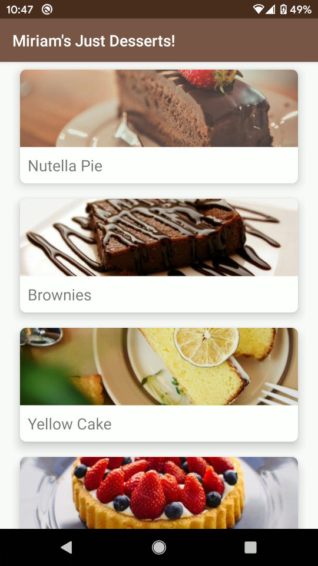

# Miriam's Just Desserts

Recipe app from the Android Developer(Java) Nanodegree at Udacity. It demonstrates the use of RecyclerView, ExoPlayer, Master/Detail Flow, and Material Design.

# Demo

The demo video is linked below.

## Step-By-Step
* The "Miriam's..." icon on the Home Page launches the app.
* A list of recipes appears.
* When a recipe is chosen, an expandable ingredients listing is shown with a series of steps.
* Steps can be clicked to display detailed instructions, along with a helpful video.
* A Home Screen Widget can be installed showing ingredients for the currently selected recipe.
* Choosing another recipe will update the Widget with that recipe's ingredients.

## Video Demo

## License
[MIT](https://choosealicense.com/licenses/mit/)
